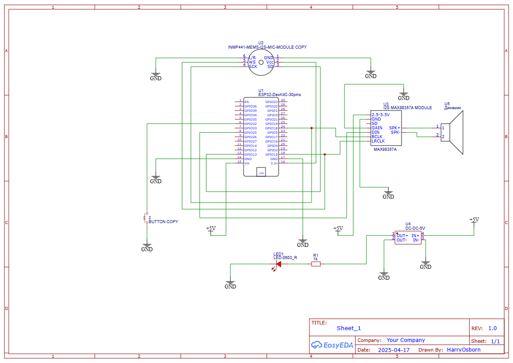
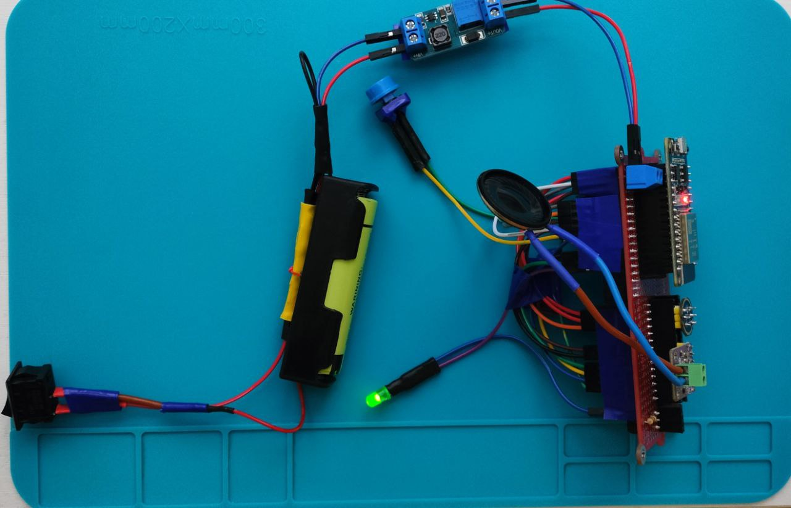
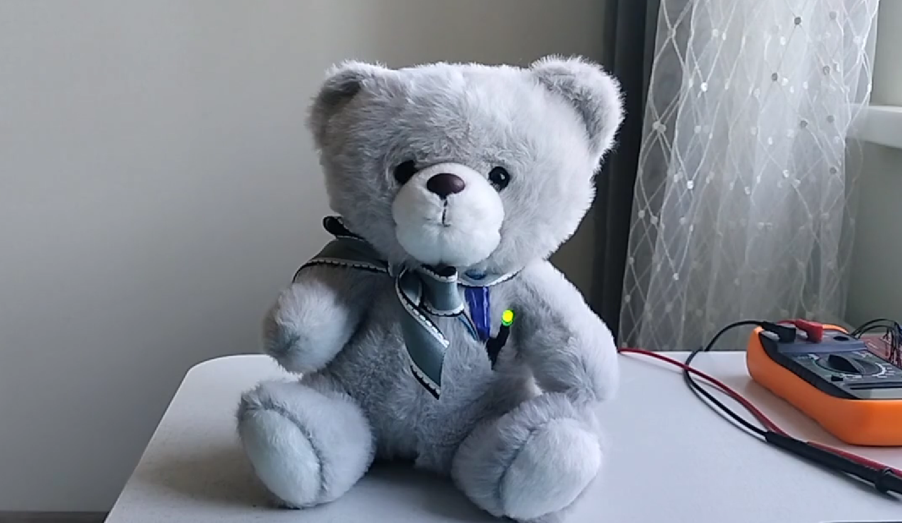

# TedToy - ESP32 AI Toy

## Project Overview
TedToy is a compact AI toy built with an ESP32 microcontroller that can:
1. Capture audio through a microphone connected to the ESP32
2. Send the audio to a server via WebSocket 
3. Process the audio through a speech-to-text (STT) -> LLM -> text-to-speech (TTS) pipeline
4. Stream the audio response back to the ESP32 for playback

While primarily designed as an interactive AI toy, TedToy can be easily transformed into a full-fledged voice assistant with minimal modifications.

## System Architecture

### ESP32 Client
- Records audio when triggered by button press
- Connects to server via WebSocket protocol
- Sends START_RECORDING/STOP_RECORDING commands
- Streams audio data in 16kHz, 16-bit PCM, mono format
- Receives TTS audio responses in the same format
- Plays audio through I2S DAC/amplifier

### WebSocket Server
- Hosted on `0.0.0.0:8765`
- Accepts WebSocket connections from ESP32 clients
- Saves received audio as WAV files
- Triggers pipeline processing
- Streams TTS responses back to client

### LLM Pipeline
- Processes audio using a multi-stage pipeline:
  - Speech-to-text conversion
  - LLM processing with LangGraph agent architecture
  - Text-to-speech generation
- Supports multiple model providers (Together AI, DeepInfra, Mistral AI)
- Includes tools for web search and data validation

### Text-to-Speech
- Supports multiple TTS providers including Cartesia API
- Streams TTS audio directly to the ESP32 in real-time
- Automatically resamples from 24kHz to 16kHz for ESP32 compatibility
- Configurable voice features through environment variables

## Hardware Requirements

### Components
- ESP32 development board
- I2S microphone (e.g., INMP441)
- I2S DAC/amplifier (e.g., MAX98357A)
- Push button
- Speaker
- Battery

### Wiring
The schematics for the hardware setup can be found in the `schematic/` directory.

<!--  -->



#### Microphone Connections (I2S_NUM_0)
- SCK: GPIO 18
- WS: GPIO 15
- SD: GPIO 13

#### DAC/Amplifier Connections (I2S_NUM_1)
- DOUT: GPIO 25
- BCLK: GPIO 27
- LRCK: GPIO 26

#### Button Connection
- Button: GPIO 32 (with internal pull-up resistor)

## Software Setup

### Prerequisites
- Python 3.7+ with the required dependencies
- Arduino IDE with ESP32 board support
- API keys for selected services (see example.env)

### Server Setup
1. Clone this repository
2. Copy `example.env` to `.env` and fill in your API keys:
   ```
   cp example.env .env
   # Edit .env with your API keys
   ```
3. Install the required Python dependencies:
   ```
   pip install websockets cartesia-api numpy scipy python-dotenv langgraph
   ```
4. Run the WebSocket server:
   ```
   python server/main.py
   ```

### ESP32 Setup
1. Open the `esp32/full_code_send_reveive_play/full_code_send_reveive_play.ino` in Arduino IDE
2. Update the WiFi credentials and WebSocket server IP address:
   ```cpp
   const char* ssid = "your_wifi_ssid";
   const char* password = "your_wifi_password";
   const char* websockets_server_host = "your_server_ip";
   ```
3. Install required Arduino libraries:
   - WebSocketsClient
   - Arduino
4. Upload the sketch to your ESP32

## Usage
1. Start the WebSocket server on your computer
2. Power on the ESP32 device
3. Press the button to start recording
4. Ask your question
5. Press the button again to stop recording
6. Wait for the audio response to play through the speaker

## Media
- [Project Demo Video](video/tedtoy.mp4)

## Project Structure
- `esp32/`: Arduino code for the ESP32
- `server/`: WebSocket server and audio processing
  - `main.py`: WebSocket server implementation
  - `pipeline_script.py`: Audio processing pipeline
  - `audio_convert.py`: Audio conversion utilities
- `langgraph/`: LLM agent implementation
  - `agent.py`: Main agent architecture
  - `tools.py`: Tool implementations for the agent
- `chat/`: Chat functionality and message handling
- `utils/`: Utility functions and helpers
- `config/`: Configuration files
- `data/`: Data storage
- `database/`: Database implementation
- `schematic/`: Hardware connection diagrams
- `websocket/`: WebSocket client test scripts
- `received_audio_wav/`: Directory where audio files are saved
- `video/`: Directory for video files (if any related to the project)
- `LICENSE`: The project's license file.
- `.gitignore`: Specifies intentionally untracked files that Git should ignore.
- `example.env`: Example environment variables file.
- `README.md`: This file.

## Configuration
The project uses environment variables for configuration. Copy the `example.env` file to `.env` and customize:

- LLM providers and models: Together AI, DeepInfra, Mistral AI
- TTS providers: Cartesia, AssemblyAI
- API keys for various services
- Voice feature toggles

## Troubleshooting
- If the ESP32 fails to connect to WiFi, check your credentials
- If the WebSocket connection fails, verify the server IP address and port
- If audio recording is too quiet, adjust the microphone gain
- If playback is distorted, adjust the `FIXED_VOLUME` value in the ESP32 code
- Check the `.env` file for correct API keys if services fail

## Future Improvements
- Add LED indicators for system status
- Implement wake word detection
- Add battery power for portability
- Optimize audio quality and latency
- Add local speech processing for offline operation

## License
This project is open source and available under the MIT License.
